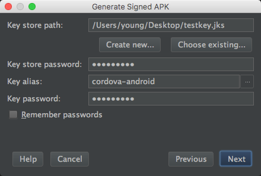

## CodePush使用调研
`2016-11-25`

- CodePush是一个微软开发的云服务器。通过它，开发者可以直接在用户的设备上部署手机应用更新。CodePush相当于一个中心仓库，开发者可以推送当前的更新（包括JS/HTML/CSS/IMAGE等）到CoduPush，然后应用将会查询是否有更新。
 
#### 安装CodePush CLI
管理 CodePush 账号需要通过`NodeJS-based CLI.`。只需要在控制台输入 `npm install -g code-push-cli`，就可以安装了。安装完毕后，输入 code-push -v查看版本代表成功。目前我的版本是 1.1.1-beta
#### 创建CodePush账号
- 在控制台输入 `code-push register` 后，将会打开一个网页进行注册。CodePush账号支持 github和 Microsofe，选其中一个就可以了。
- 我选择的是 github，授权完毕后，网页将会显示一个token，复制它到控制台的中就成功了。
- 成功登陆后，你的session文件将会写在 /Users/guanMac/.code-push.config。
- 相关命令:
    - `code-push login` 登陆
    - `code-push loout` 注销
    - `code-push access-key ls` 列出登陆的token
    - `code-push access-key rm <accessKye>` 删除某个 access-key
#### 在CodePush服务器上注册app
- 为了让codePush服务器知道你的app，我们需要向它注册app： `code-push app add <appName>`，就可以了。
- CODE-PUSH APP相关命令:
    - `add`在账号里面添加一个新的app
    - `remove` 或者 `rm` 在账号里移除一个app
    - `rename` 重命名一个存在app
    - `list` 或则 `ls` 列出账号下面的所有app
    - `transfer` 把app的所有权转移到另外一个账号
 
#### 在app中添加SDK
- `cordova plugin add cordova-plugin-code-push@latest --save`
- 配置config.xml: 在你的 index.html 中允许安全策略，添加 https://codepush.azurewebsites.net 的域名：`<meta http-equiv="Content-Security-Policy" content="default-src https://codepush.azurewebsites.net ... />`
     
#### 部署APP相关命令
- `code-push deployment add <appName>` 部署
- `code-push deployment rename <appName>` 重命名
- `code-push deployment rm <appName>` 删除部署
- `code-push deployment ls <appName>` 列出应用的部署情况
- `code-push deployment ls <appName> -k` 查看部署的key
- 查看已发布的版本: `code-push deployment history ioeIOS Staging`
- 删除已发布的所有版本: `code-push deployment clear ioeIOS Staging`
#### 发布
- release有很多种形式, 我们用`release-cordova <appName> <platform> --deploymentName Production --description 我是备注`
- 

#### 参考文档
- [http://bbs.reactnative.cn/topic/725/code-push-%E7%83%AD%E6%9B%B4%E6%96%B0%E4%BD%BF%E7%94%A8%E8%AF%A6%E7%BB%86%E8%AF%B4%E6%98%8E%E5%92%8C%E6%95%99%E7%A8%8B/2](http://bbs.reactnative.cn/topic/725/code-push-%E7%83%AD%E6%9B%B4%E6%96%B0%E4%BD%BF%E7%94%A8%E8%AF%A6%E7%BB%86%E8%AF%B4%E6%98%8E%E5%92%8C%E6%95%99%E7%A8%8B/2)
- [https://github.com/Microsoft/code-push/tree/master/cli#releasing-updates-general](https://github.com/Microsoft/code-push/tree/master/cli#releasing-updates-general)
- [https://microsoft.github.io/code-push/docs/cordova.html#link-5](https://microsoft.github.io/code-push/docs/cordova.html#link-5)
- [官网文档](https://github.com/Microsoft/code-push/blob/master/cli/README-cn.md)