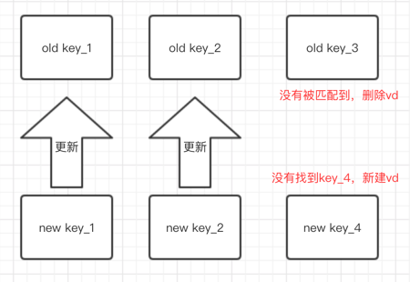

## virtual-dom learning
`2018-12-12`

### react

#### key
- key 是用来标志一个组件的唯一身份，他不是给开发者用的，他是方便 diff 的时候唯一确定组件的。
- diff的过程中，找到key相同的组件时，react认为这是同一个组件，就不会为新的组件创建vd，而是直接用新的属性修改老的组件。
- 当遍历完也没找到相同的key，就认为这是一个新的组件，需要创建vd。
- 而老的vd树里，没有与新的vd树的key匹配到的，就认为是应该被删除的vd。

#### ...未完待续